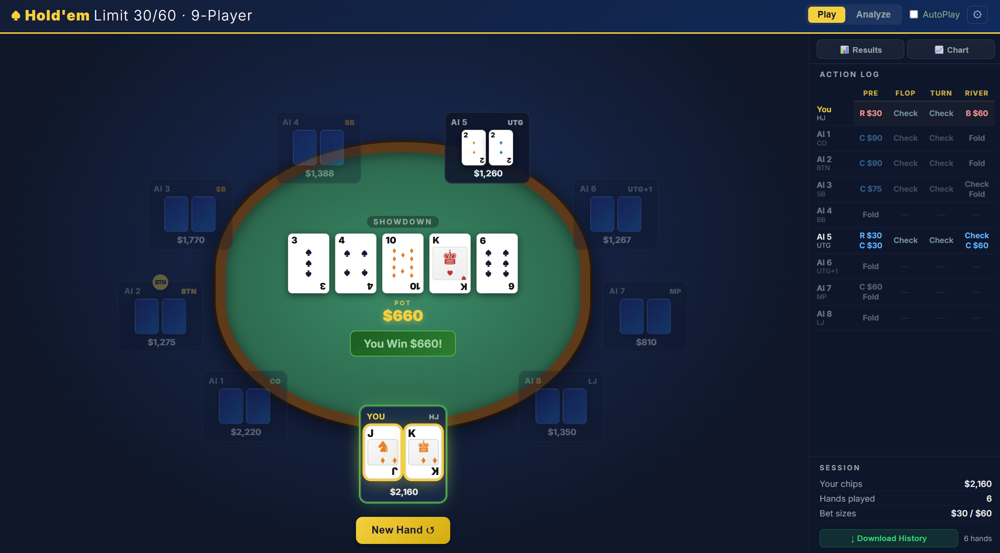
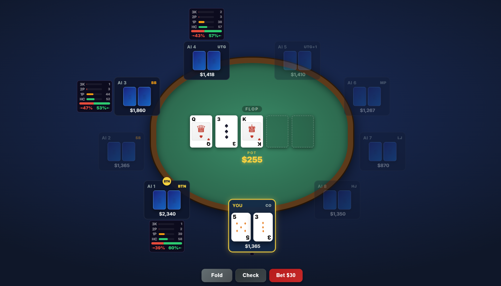

# ♠️ Limit Hold'em Trainer

**[👉 點此立即遊玩 (Play Now)](https://taining1237.github.io/limit-holdem-trainer/)**

這個故事起源於在咖啡廳想玩 Limit Hold'em，於是嘗試用最新的開發工具 Claude Code 實作。結果開發出來的效果很漂亮，但在加入多人連線功能時改了很多次才調整好。這個專案是與 Anti-Gravity 合作完成的！🙌


*遊戲畫面*


*按右上角Analyze打開分析小視窗*

## ✨ 目前具備的功能

### 1. 🎮 遊戲模式
* **單人練習**：可以隨時隨地練習自己打，並觀察每個 AI 底層的思考邏輯。
* **多人連線**：支援線上開房，可以邀請朋友加入房間一起對戰！
* **自定義人數**：開源程式碼支援 2 到 9 人彈性調整桌上人數。

### 2. 📊 分析與紀錄
* **遊戲數據**：提供 Results 與 Charts 圖表，輕鬆追蹤你的籌碼與勝率起伏。
* **歷程追蹤**：包含詳細的 Action Log 與即時分析功能，方便隨時檢討牌局。
* **強大演算法**：AI 底層採用 **蒙地卡羅（Monte Carlo）** 方法撰寫，帶來真實的對戰體驗。
* **外部匯入**：支援一鍵下載 History 歷史紀錄，並可上傳至任何你慣用的 Poker Tracker 進行深度覆盤。


### 3. 🤖 AI 底層邏輯解析
這款 Trainer 的對手 AI 邏輯非常特別，你可以把它們想像成一桌「具有嚴格數學紀律，且絕大部分時間都很老實的玩家」：
* **Pre-Flop (翻牌前) 機制**：並非採用龐大複雜的 Solver 查表，而是以 **Chen Formula (陳氏公式)** 計算起手牌分數，依照分數與位置動態給出行動機率。
* **Post-Flop (翻牌後) 核心**：採用 **蒙地卡羅 (Monte Carlo)** 模擬未知的牌局發展，算出真實勝率（Equity）後，與底池賠率（Pot Odds）進行線性 (Linear) 對比來做決策。
* **極低且固定的詐唬頻率 (Minimal Fixed Bluffing)**：有別於高階的 GTO（Game Theory Optimal）理論會根據底池賠率精確計算出詐唬頻率（例如計算出自己應該包含 30% 的詐唬牌），這群 AI 在處於絕對劣勢（勝率極低）時，**只會套用固定且極低的 6% 機率進行純詐唬 (Pure Bluff)**。這意味著當它們強力下注或加注時，高達 94% 以上的機率是真的有牌！

在這個環境中訓練的主要目標是：**「如果你連這群遵守嚴格數學紀律、偶爾才偷雞的老實 AI 都嬴不了，那先別想著對人 Bluff，先把自己的手牌價值與 Pot odds 計算練好。」**
這非常適合做為初中階玩家的基礎功訓練，幫你養成紮實的牌力判斷與下注紀律。

## 🛠️ 本地開發與運行 (Local Development)

本專案使用 Firebase Realtime Database 作為多人連線的後端。為了保護安全性，Firebase 的 API 金鑰並未包含在公開的原始碼中。

如果你想要 `clone` 這個專案並在本地端運行或修改，請依照以下步驟設定你的環境：

1. **取得程式碼**：
   ```bash
   git clone https://github.com/TaiNing1237/limit-holdem-trainer.git
   cd limit-holdem-trainer
   ```

2. **建立設定檔**：
   在 `js/` 資料夾下，新增一個名為 `config.js` 的檔案（這個檔案已經被加進 `.gitignore` 中，不會被推送到你的遠端庫）。

3. **貼上 Firebase 金鑰**：
   將你在 Firebase 控制台取得的專案設定貼入 `config.js` 中：
   ```javascript
   // js/config.js
   const FIREBASE_CONFIG = {
     apiKey: "YOUR_API_KEY",
     authDomain: "YOUR_PROJECT_ID.firebaseapp.com",
     databaseURL: "https://YOUR_PROJECT_ID-default-rtdb.asia-southeast1.firebasedatabase.app",
     projectId: "YOUR_PROJECT_ID",
     storageBucket: "YOUR_PROJECT_ID.firebasestorage.app",
     messagingSenderId: "YOUR_SENDER_ID",
     appId: "YOUR_APP_ID"
   };
   ```

4. **啟動專案**：
   因為本專案為純前端架構 (Vanilla JS / HTML / CSS)，只要使用任何本地伺服器（例如 VS Code 的 Live Server 或 Python 的 HTTP Server）開啟根目錄的 `index.html` 即可：
   ```bash
   python -m http.server 8000
   ```

---
🚀 **歡迎大家自行取用與 Fork！**
希望這個小專案能帶給你充滿樂趣的德州撲克時光！Have fun solving and bluffing! 🎉
